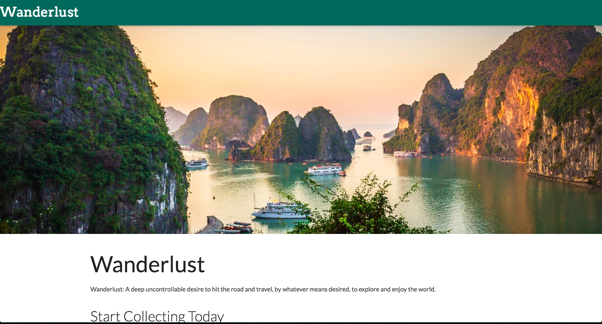

# Wanderlust a Q2-Travel-Project

## [Wanderlust](https://stringer86-wanderlust.herokuapp.com/)

Wanderlust is a travel-themed web application inspired by the desire to travel. It enables users to research possible vacation areas by country or city name and save these locations for reference.

##Technologies used include:

* Node.js
* Express
* Express Validation
* postgreSQL
* Knex.js
* Materialize CSS
* Boom
* body-parser
* cookie-parser
* request
* humps
* jsonwebtoken
* Joi

##External Apis include:

+ [DBpedia](http://lookup.dbpedia.org/api/search.asmx/KeywordSearch)
+ [Pixabay](https://pixabay.com/api/)
+ [travelbriefing.org](https://travelbriefing.org/)
+ [Google Maps](https://developers.google.com/maps/)

##Authors

+ Stephen Stringer  
+ Ross Todd

###License

This project is licensed under the MIT License - see the LICENSE.md file for details

###[Wanderlust](https://stringer86-wanderlust.herokuapp.com/)
